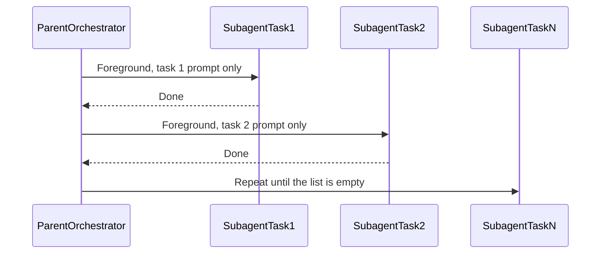

# Sequential foreground subagent tasks

This chat is the **parent orchestrator only**. It does not implement the tasks.

Run these tasks in order as separate subagents. Wait for each to finish before starting the next. Do not run them in parallel. Each subagent gets only its own task prompt plus whatever it needs from the repo.

## Paste tasks here

For each of the following numbered points in Task data section, use the below Standard task description, with the link in the points list.

### Standard task description

read @ConvertRecipePrompt.md on instructions. The recipe to convert is attached as a link to a website. The website also contains an image of the dish, please download that and put into @UI/wwwroot/images/recipe-images with the next available id plus the dish name.

### Task data

1. https://mambeno.dk/opskrifter/vegetarisk-risret-med-karry/
2. https://mambeno.dk/opskrifter/stegt-kylling-med-groentsager-og-oesterssauce-hertil-ris/
3. https://mambeno.dk/opskrifter/vegetarisk-wok-med-groentsager-oesterssauce-og-cashewnoedder/
4. https://mambeno.dk/opskrifter/karamelliseret-tofu-med-stegt-groent-i-karrysovs-hertil-vilde-ris/
5. https://mambeno.dk/opskrifter/lynhurtig-wok-med-kikaerter-og-kokosmaelk/
6. https://mambeno.dk/opskrifter/vietnamesisk-risret-med-kylling-og-ristede-log/
7. https://mambeno.dk/opskrifter/kokos-peanutnudler-kylling/
8. https://mambeno.dk/opskrifter/super-nem-chicken-tikka-masala-til-to-dage/
9. https://mambeno.dk/opskrifter/mexicansk-risret-med-peberfrugt-og-kidneyboenner-hertil-guacamole-og-majskolber/?_gl=1*1jsrhzb*_up*MQ..*_ga*NDQ0MjYwNTAzLjE3ODY2OTIyMDc.*_ga_MFPYKW15ZT*czE3ODgzNTg4NjEkbzIkZzEkdDE3ODgzNTg4NzUkajQ2JGwwJGgw
10. https://mambeno.dk/opskrifter/vegetarisk-risret-med-tacokrydderi/?_gl=1*1jsrhzb*_up*MQ..*_ga*NDQ0MjYwNTAzLjE3ODY2OTIyMDc.*_ga_MFPYKW15ZT*czE3ODgzNTg4NjEkbzIkZzEkdDE3ODgzNTg4NzUkajQ2JGwwJGgw
11. https://mambeno.dk/opskrifter/fajita-med-kidneyboenner-og-spidskaal-hertil-ris-og-creme-fraiche/?_gl=1*1jsrhzb*_up*MQ..*_ga*NDQ0MjYwNTAzLjE3ODY2OTIyMDc.*_ga_MFPYKW15ZT*czE3ODgzNTg4NjEkbzIkZzEkdDE3ODgzNTg4NzUkajQ2JGwwJGgw
12. https://mambeno.dk/opskrifter/fyldig-fajitasuppe-med-sorte-boenner-hertil-hjemmelavede-tortillachips/?_gl=1*1jsrhzb*_up*MQ..*_ga*NDQ0MjYwNTAzLjE3ODY2OTIyMDc.*_ga_MFPYKW15ZT*czE3ODgzNTg4NjEkbzIkZzEkdDE3ODgzNTg4NzUkajQ2JGwwJGgw
13. https://mambeno.dk/opskrifter/mexicansk-gryderet-med-kylling-og-kidneyboenner/?_gl=1*1jsrhzb*_up*MQ..*_ga*NDQ0MjYwNTAzLjE3ODY2OTIyMDc.*_ga_MFPYKW15ZT*czE3ODgzNTg4NjEkbzIkZzEkdDE3ODgzNTg4NzUkajQ2JGwwJGgw
14. https://mambeno.dk/opskrifter/tacogryde-med-ris-majs-avocado-og-tortillachips-til-to-dage/?_gl=1*qjctih*_up*MQ..*_ga*NDQ0MjYwNTAzLjE3ODY2OTIyMDc.*_ga_MFPYKW15ZT*czE3ODgzNTg4NjEkbzIkZzEkdDE3ODgzNTg4NzUkajQ2JGwwJGgw
15. https://mambeno.dk/opskrifter/lahmancun-med-kylling-og-persilledressing/
16. https://mambeno.dk/opskrifter/tunesisk-inspireret-gryderet-med-soede-kartofler-hertil-couscous/
17. https://mambeno.dk/opskrifter/tyrkiskinspireret-pastaret-med-hakket-kylling/
18. https://mambeno.dk/opskrifter/marokkansk-kylling-serveret-med-tomatsovs-og-bulgur/
19. https://mambeno.dk/opskrifter/groentsagsdeller-med-tabbouleh-ristet-broed-og-hummus/
20. https://mambeno.dk/opskrifter/smagfuld-kyllingegryde-med-groentsager-og-oliven-hertil-couscous/
21. https://mambeno.dk/opskrifter/kofta-med-kylling-hertil-bulgur-sproed-salat-og-hvidloegsdressing/
22. https://mambeno.dk/opskrifter/samosaer-med-rissalat-og-raita/

## Orchestrator rules

- One new subagent per pasted task. Fresh context. Do not `resume` a previous agent.
- Foreground only (`run_in_background: false`). The parent blocks until that agent returns.
- Never launch two Task calls in the same message.
- The subagent prompt is **only that task’s pasted text**, plus that it may read the repo (workspace `C:\Users\trmo\RiderProjects\WhatsForDinner`) to do the work. Do not paste earlier chat, earlier task prompts, or earlier agent transcripts into the next agent.
- Later tasks see earlier work because it is already in the repo, not because the parent retells it.
- If a task fails or is blocked, stop the chain and report. Do not start the next task.

